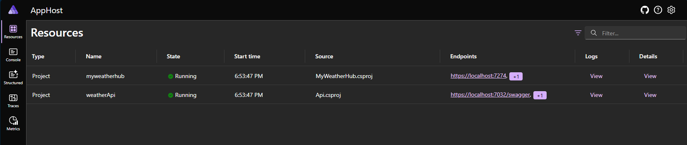
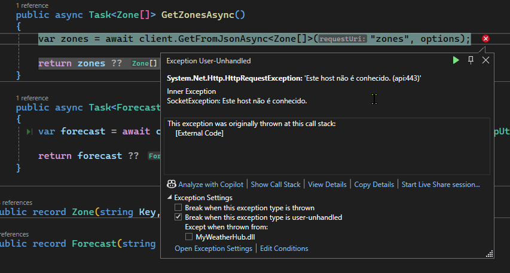
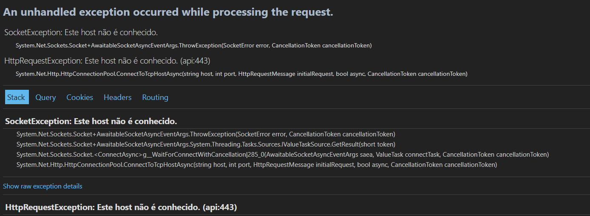
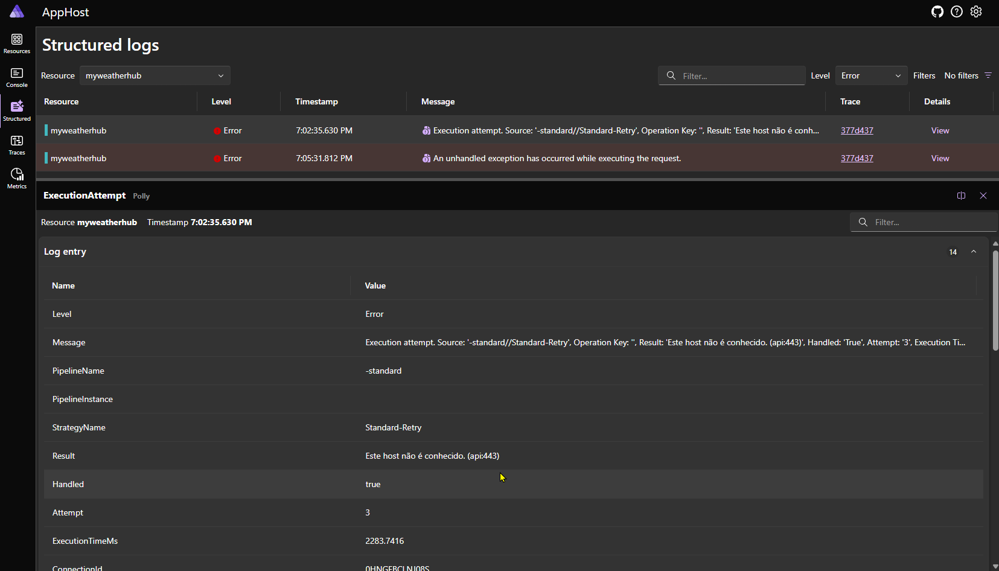
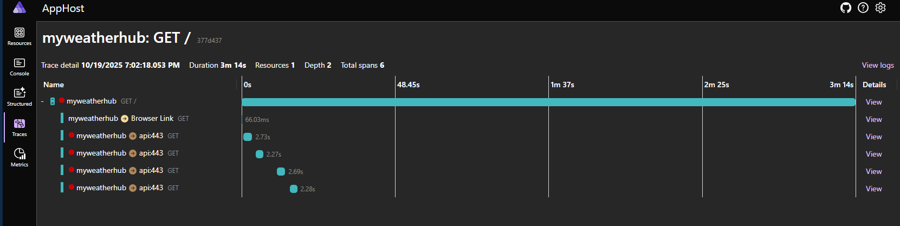

# About this repository

This repository contains tutorial level code created / copied during watching of playlist .NET Aspire for Beginners in dotnet YouTube channel, presented by  [Jeffrey Fritz (aka csharpfritz)](https://www.linkedin.com/in/jeffreytfritz/)

Link to playlist: [.NET Aspire for Beginners](https://youtube.com/playlist?list=PLdo4fOcmZ0oXIKNExrtlVtVxy_G4tgzsc&amp;si=CNt_bnHXQuFYKQN1)

Throughout this playlist, I will try to perform the actions presented in videos using shell commands wherever possible and the commands will be recorded below.

# Developer Workstation Setup - Part 2

Link to video: [Developer Workstation Setup [Pt 2] | .NET Aspire for Beginners](https://youtu.be/cA6Z8ayPXaE?si=g5UOxu2E7hXvn__c)

```bash
mkdir 01-activity
cd 01-activity
dotnet new aspire-starter --name starter-app-aspire
```

Output:
```bash
The template ".NET Aspire Starter App" was created successfully.
This template contains technologies from parties other than Microsoft, see https://aka.ms/dotnet/aspire/8.0-third-party-notices for details.

Processing post-creation actions...
Restoring [...]\01-activity\starter-app-aspire.sln:
Restore succeeded.
Restoring [...]\01-activity\starter-app-aspire.AppHost\starter-app-aspire.AppHost.csproj:
Restore succeeded.
Restoring [...]\01-activity\starter-app-aspire.ServiceDefaults\starter-app-aspire.ServiceDefaults.csproj:
Restore succeeded.
Restoring [...]\01-activity\starter-app-aspire.ApiService\starter-app-aspire.ApiService.csproj:
Restore succeeded.
Restoring [...]\01-activity\starter-app-aspire.Web\starter-app-aspire.Web.csproj:
Restore succeeded.
```

# Smart Defaults for your system - Part 3

Link to the video: [Smart Defaults for your system [Pt 3] | .NET Aspire for Beginners](https://youtu.be/bjiNpz15lf0?si=Y6M5AB2R-_BfRCha)

```bash
cd 02-activity
dotnet new aspire-servicedefaults --name ServiceDefaults
```

Output:
```bash
The template ".NET Aspire Service Defaults" was created successfully.
This template contains technologies from parties other than Microsoft, see https://aka.ms/dotnet/aspire/8.0-third-party-notices for details.

Processing post-creation actions...
Restoring [...]\02-activity\ServiceDefaults\ServiceDefaults.csproj:
Restore succeeded.
```

Added `ServiceDefaults` project to the solution using Visual Studio GUI and added references in each project - `Api` and `MyWeatherHub` - via CLI commands as shown below:

```bash
cd 02-activity
cd Api
dotnet add reference ../ServiceDefaults/
cd ..
cd MyWeatherHub
dotnet add reference ../ServiceDefaults/
```

Output:
```bash
Reference `..\ServiceDefaults\ServiceDefaults.csproj` added to the project.
Reference `..\ServiceDefaults\ServiceDefaults.csproj` added to the project.
```

# Orchestration and the Dashboard - Part 4

Link to the video: [Orchestration and the Dashboard [Pt 4] | .NET Aspire for Beginners](https://youtu.be/kgd3xK8Nz38?si=yAKLcu7pBrMdHOCi)

Creation of initial project
```bash
mkdir 03-activity
cd 03-activity
dotnet new aspire-apphost -n AppHost
```

Creation of a new solution
```bash
dotnet new sln --name Orchestration-Dashboard
```

Added initial project to the solution
```bash
dotnet solution add AppHost/AppHost.csproj
```
Make copy of Api, MyWeatherHub and ServiceDefaults from folder `02-activity` to folder `03-activity`
```bash
cd ..
cp -r 02-activity/Api 03-activity/Api
cp -r 02-activity/MyWeatherHub 03-activity/MyWeatherHub
cp -r 02-activity/ServiceDefaults 03-activity/ServiceDefaults

cd 03-activity
dotnet solution add Api/Api.csproj
dotnet solution add MyWeatherHub/MyWeatherHub.csproj
dotnet solution add ServiceDefaults/ServiceDefaults.csproj 
```

AppHost and ServiceDefaults projects were updated to .NET 9

```bash
cd AppHost
dotnet add reference ../Api/Api.csproj
dotnet add reference ../MyWeatherHub/ #Only path added, command auto-discovers the project inside
```


# Service Discovery - Part 5

Link to the video: [Simplifying communications with Service Discovery [Pt 5] | .NET Aspire for Beginners](https://youtu.be/l0ebdWo_Llw?si=82U9uTZT_iGMyQny)

```bash
mkdir 04-activity
cd 03-activity
cp -r -v . ../04-activity
cd ../04-activity
mv Orchestration-Dashboard.sln Service-Discovery.sln
```

After basic service discovery was presented, one error was simulated to show what happens when naming conversions are violated and prevent service discovery to happens normally.

Error was introduced in commit shown below:

```diff
commit 1a249c3
Author: Dickson Souza <36424026+disouzam@users.noreply.github.com>
Date:   Sun Oct 19 19:02:05 2025 -0300

    Changed string name of API from `api` to `weatherApi` to break service discovery and see what happens
---
 04-activity/AppHost/Program.cs | 2 +-
 1 file changed, 1 insertion(+), 1 deletion(-)

diff --git a/04-activity/AppHost/Program.cs b/04-activity/AppHost/Program.cs
index 994e650..2170722 100644
--- a/04-activity/AppHost/Program.cs
+++ b/04-activity/AppHost/Program.cs
@@ -1,6 +1,6 @@
 var builder = DistributedApplication.CreateBuilder(args);
 
-var myApi = builder.AddProject<Projects.Api>("api");
+var myApi = builder.AddProject<Projects.Api>("weatherApi");
 
 var web = builder.AddProject<Projects.MyWeatherHub>("myweatherhub")
               .WithReference(myApi)

```

Solution is built correctly without any compiling errors but once one tries to open MyWeatherHub web application error appears.

**Figure 1:** Application started normally


**Figure 2:** Exception raised because service discovery failed due to the error intentionally introduced


**Figure 3:** Exception details


**Figure 4:** Failed retries by auto-configured Polly (via Service Defaults)


**Figure 5:** Traces of the original request and retries
